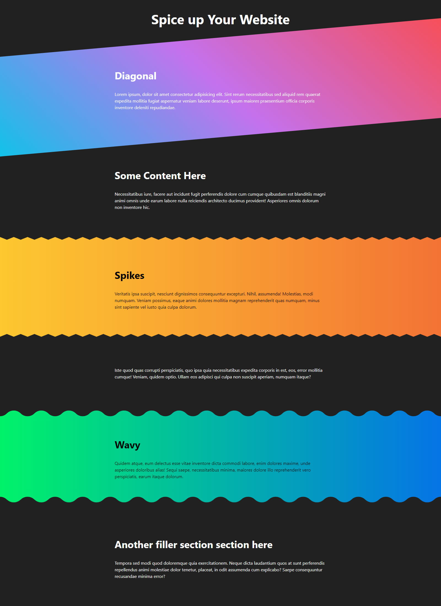
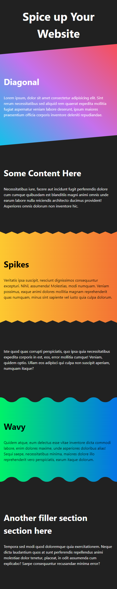

# spice-up-your-website

<figure>
  
  <figcaption>Desktop image of beautifying your websites</figcaption>
</figure>

# Mobile image

<figure>
  
  <figcaption>Mobile image of beautifying your websites</figcaption>
</figure>

<h1>How it was Building</h1>
<h3>Technologies used & resources</h3>

    -HTML

    -CSS

    -CSS Generator

   For waves

 For SVG To create the SVG.

I followed a Youtube from Kevin Powell

For More tricks and updates on css check Kevin powell on youtube <a target="_blank" href="https://www.youtube.com/@KevinPowell">@KevinPowell</a>

